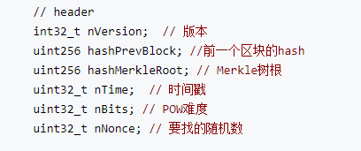
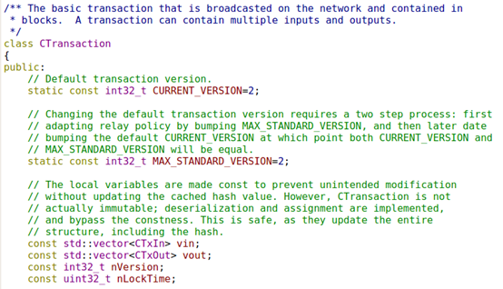
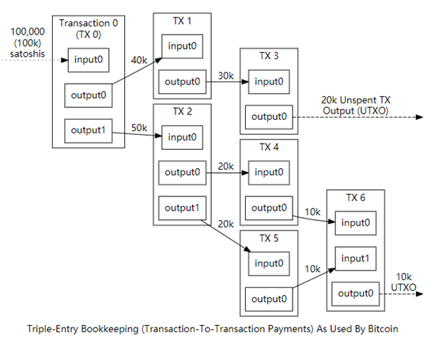
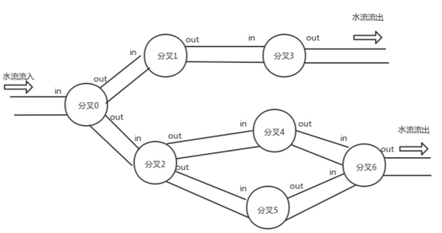
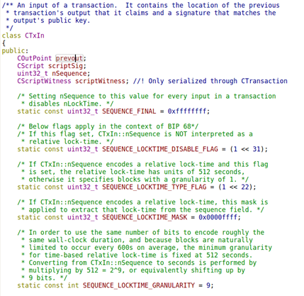
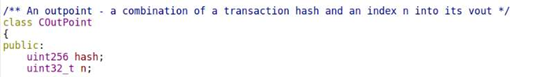
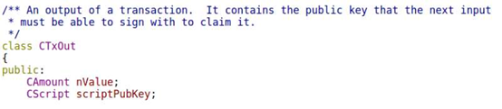
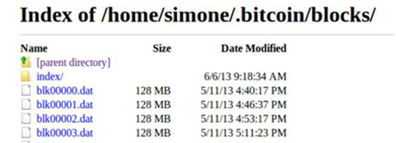

# Bitcoin

## 一：区块结构

比特币区块由以下几项组成：

| 数据项              | 字节 | 字段       | 说明                                                         |
| ------------------- | ---- | ---------- | ------------------------------------------------------------ |
| Magic Number        | 4    | 魔数       | 常数0xD9B4BEF9                                               |
| Blocksize           | 4    | 区块大小   | 用字节表示的该字段之后的区块大小                             |
| Blockheader         | 80   | 区块头     | 组成区块头的几个字段                                         |
| Transaction counter | 1-9  | 交易计数器 | 该区块包含的交易数量                                         |
| Transactions        | 不定 | 交易       | 记录在区块里的交易信息，使用原生的交易信息格式，并且交易在数据流中的位置必须与Merkle树的叶子节点顺序一致。 |

###  1.1魔数

​      每个区块的大小是2M以下，区块数据存储在区块文件中（形如：blkxxxx0.dat），区块与区块之间利用“魔数”或“神奇数”分隔（0xF9BEB4D9），一个区块存储文件可以存储多个区块数据，该文件也有大小限制，达到上限（128M左右），就会重新建立一个文件存储区块数据，文件名加1（形如：blkxxxx1.dat）。

​      从原始数据中读取的流程大概如下：

​     1：4个字节，比对magic_number。

​     2：匹配，读取后4个字节，得到块的大小m。

​    3：后面m个字节，得到区块的数据。

​    4：第一步，读取下一个区块。

### 1.2 区块头

​     CBlockHeader：

| 字节 | 字段           | 说明                                                         |
| ---- | -------------- | ------------------------------------------------------------ |
| 4    | 版本           | 区块版本号，表示本区块遵守的验证规则                         |
| 32   | 父区块头哈希值 | 前一区块的哈希值，使用SHA256(SHA256(父区块头))计算           |
| 32   | Merkle根       | 该区块中交易的Merkle树根的哈希值，同样采用SHA256(SHA256())计算 |
| 4    | 时间戳         | 该区块产生的近似时间，精确到秒的UNIX时间戳，必须严格大于前11个区块时间的中值，同时全节点也会拒绝那些超出自己2个小时时间戳的区块 |
| 4    | 难度目标       | 该区块工作量证明算法的难度目标，已经使用特定算法编码         |
| 4    | Nonce          | 为了找到满足难度目标所设定的随机数，为了解决32位随机数在算力飞升的情况下不够用的问题，规定时间戳和coinbase交易信息均可更改，以此扩展nonce的位数 |

### 1.3 交易

一个完整的交易由以下的元素构成的：

​    版本 version。

​    输入 tx_in。//比特币交易的 “收入”

​    输出 tx_out//比特币交易的 “支出”

​    锁定时间 lock_time。

版本(version)是明确一笔交易参照的规则，除非有重大升级的情况下，版本号基本无变化，是比较固定的一个值。

其中交易的输入和输出有可能是一个或多个。

lock_time是一个多意字段，表示在某个高度的Block之前或某个时间点之前该交易处于锁定态，无法收录进Block。在大多数的情况下他的值都是0，表示需要立即被加入区块中。如果锁定时间大于0而小于5亿，它的值就表示区块高度。如果大于5亿就表示一个Unix时间戳。

| 值           | 含义                                             |
| ------------ | ------------------------------------------------ |
| 0            | 立即生效                                         |
| < 500000000  | 含义为Block高度，处于该Block之前为锁定（不生效） |
| >= 500000000 | 含义为Unix时间戳，处于该时刻之前为锁定（不生效） |

 

#### 1.3.1 utxo

UTXO 是 Unspent Transaction Output 的缩写,Transaction act发音简写为X。

一个用户A有多少钱？UTXO的答案是，看多少笔交易给了A钱并且A没有花费掉，A就有多少钱。

而每个交易就是一个中转(分叉)节点，而每个交易的 in / out 就是 这个中转(分叉)节点的流入和流出。

bitcoin 有一个相当相当重要的规定就是 每个 Tx 的 所有 In 进入了货币流必须在这个交易中全部流出去(流出去不代表成为其他Tx的In，而是必须要成为一个 TxOut。)

举例来说：如果A 转账 100 给 B，但是现在A能控制的Out (CTxIn中的preout)有2个，一个是Out1是60，一个是Out2是50，那么A一检查自己的Out就会发现，60和50都不够100，那么就只能把 Out1 和 Out2 都作为当前要生产的 Tx 的 In。但是这种情况下，所有In的和就大于要支出的 100了。那么如果不付交易费的话，除去转账给 B 的 100 所对应的当前Tx的 Out，那么还会多出10。在bitcoin中就强行规定，这多出的10也要创建一个 Out 来锁住这10 块，以规定每笔交易的 In 和 Out 的总数都要相同。那么因为这 10 相当于我们通俗意义上的“找零”，所以这个 10 块的 Out 的锁当然就是 A 自己可以控制的锁，相当于这个Out指向了自己。

####  1.3.2 txin

每个非coinbase的交易输入都是之前某个交易的交易输出。（UTXO）

CoutPoint Preout: 依赖的输出

​           hash 指代的就是 txin 所来自的那个Tx的 hash。  n指代这个 in 是来自上一个交易的第 n 个out。

signature script代表着解锁脚本（拥有者对该交易的ECDSA签名认可），解锁脚本与锁定脚本相对应，只有按锁

定脚本的规则去解，才能花掉这个脚本上对应的资产，位于交易的输入。

#### 1.3.3 txout

显然一个 Tx 的所有 TxOut 的 value 的和 应该等于 所有 TxIn 流入的总和 (不考虑手续费，如果考虑手续费就是小于等于)，否则这笔交易就应该认为是非法的(不能凭空多出钱来)。

## 二：存储的过程

比特币存储系统由普通文件和 kv 数据库(levelDB)组成。普通文件用于存储区块链数据，kv 数据库用于存储区块链元数据。

用于存储区块链数据的普通文件以 blk00000.dat , blk00001.dat 文件名格式组成，如图2所示，其中 index 目录存储用于存储区块元数据（kv数据库存储着对于这些dat文件的索引文件。）。

为了快速检索区块数据每个文件的大小是128 M Bytes。每个区块的数据（区块头和区块里的所有交易）都会序列成字节码的形式写入 dat 文件中。

在序列化的过程中，如果检测到当前写入文件尺寸加上区块尺寸大于 128 M Bytes，则会重新生成一个 dat 文件。具体的序列化过程如下所述：

·         获取当前 dat 文件大小 npos（起始位置），并将区块大小追加写入至 dat 文件中

·         序列化区块数据和区块中的交易数据，并将序列化的数据追加至 dat 文件中。

·         在写入数据的过程中，会生成区块和交易相关的元数据。

区块的元数据（索引）格式如 <blockHash,xxxxx+npos> 格式， 其中 xxxxx 为 dat 文件序号，npos 为区块写入 dat 文件的起始位置。

交易的元数据（索引）格式如 <txHash, xxxxx+npos+nTxOffset> 格式， 其中 xxxxx、npos 和上面的描述一致，nTxOffset 为写入 dat 文件的起始位置（基于npos 位置）。

上述所有元数据都将写入 kv 数据库中，其中 blockhash/txHash 将作为后续查询具体数据在 dat 文件中的索引使用。

综上所述，在获取链数据的时候只需传入区哈希或是交易哈希，就能很容易的定位到区块数据或是交易数据。

