# EOS

EOS采用DPoS算法和块内分片技术，实现了百万级别TPS的超高性能，可以媲美中心化服务器的处理能力，同时保持去中心化的属性。

EOS通过股东投票选举出可信的21个超级节点，然后由他们轮流生产区块，每3秒出一个区块，这样就避免的POW算法的耗时问题，相当于信任提前建立起来。但是3秒的确认时间也是太长了，所以EOS采用块内分片技术，即在区块中维护了一条私有区块链，将一个block分割成多个cycle（循环），每个cycle的生成时间很短，而且不用等待完整的block确认完成（3秒），生成后直接异步广播发送，这样，交易在很快就被确认了。另外，块内分片使交易确认时间更平滑，比如，Bob向Alice的转账信息如果在打包最后时刻发送，那么交易确认时间几乎是0秒，如果在打包开始时刻发送，打包时间则是3秒。

cycle可以理解为block内部的私有区块，主要用于提升交易确认速度，不需要等待一个完整block打包时间。一个cycle内部包含一个shard（分片）集合，cycle和cycle之间是串行处理打包的。


交易时间缩短了，但是面对海量并发的交易数据，还是无法提供高TPS的表现，那么EOS如何解决高并发问题呢？EOS引入了shard概念，在打包cycle的时候，由多个shard并行处理交易信息。每个shard是一个线程，在线程内部的交易是顺序处理的，在线程间的交易是并行处理的。


问题来了，究竟哪些交易可以并行执行，哪些交易只能串行执行？EOS的设计者给出如下解释，涉及同一个账户U的交易A和B，只能包含在同一个cycle中的同一个shard或者包含在不同cycle的shard中，也就是说涉及相同账户的交易必须串行处理。

简单打个比方，有如下两笔涉及同一个账户的交易：

Transaction A：Bob将账户的10个token转给Alice（Alice的账户最开始为空）；

Transaction B：Alice将接收到的10个token中的5个转给Carol；

如果Transaction B先于A执行，则因为Alice的账户为空，无法转账给Carol，出现验证失败，所以必须保证Transaction A在B前执行。这样，在一个cycle内，生产者可以利用多核多线程并发的处理“不相干”的Transaction，极大的提升交易处理速度。

## 一：区块结构

​			

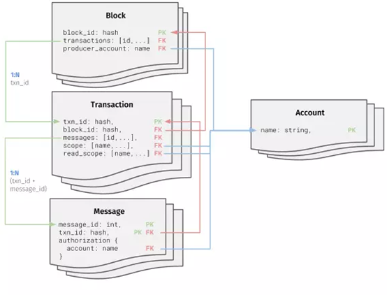

### 1.1：block

| Field                   | Type                     | Description                                                  |
| ----------------------- | ------------------------ | ------------------------------------------------------------ |
| id                      | String                   | System unique id （系统唯一标识符）                          |
| block_num               | Integer                  | Ordinal numeric identifier （序号数字标识符）                |
| previous                | String                   | SHA256 of previous block （上个区块的SHA256）                |
| timestamp               | MongoDB Date (timestamp) | Scheduled time （计划时间）                                  |
| transaction_merkle_root | String                   | checksum (SHA256) of block when generated   （区块产生时的校验和 (SHA256)） |
| producer                | String                   | Account name of block producer （区块生产者的账户名）        |
| producer_signature      | String                   |                                                              |
| transactions            | [ObjectId,...]           | List of transaction ids associated with   this block （这个区块关联的交易 ids 列表） |
| ref_block_prefix        | Integer                  | 引用的区块前缀                                               |
| producer_changes        | Array                    | Changes to list of producers （区块生产者变更列表）   EOS 架构中区块的产生是以 21   个区块为一个周期，在每个出块周期开始前，21 个区块生成者会被投票选出。producer_change 就记录了未来的 21 个出块者。 |

### 1.2：transaction

| Field                     | Type     | Description                                             |
| :------------------------ | -------- | ------------------------------------------------------- |
| TransactionID             | Objectid | System unique id （系统唯一标识符）当前这笔交易的hash值 |
| Ref_block_num             | integer  | 引用的区块号                                            |
| Ref_block_prefix          | Integer  | 引用的区块头                                            |
| Expiration                | String   | 交易过期时间                                            |
| Scope                     | Array    | Account Scope 账户范围                                  |
| Transaction merkle   root | String   | 区块产生时的校验和                                      |
| Producer account   id     | String   | 区块生产者的账户名                                      |
| Signatures                | Array    | Array of signatures   签名集合                          |

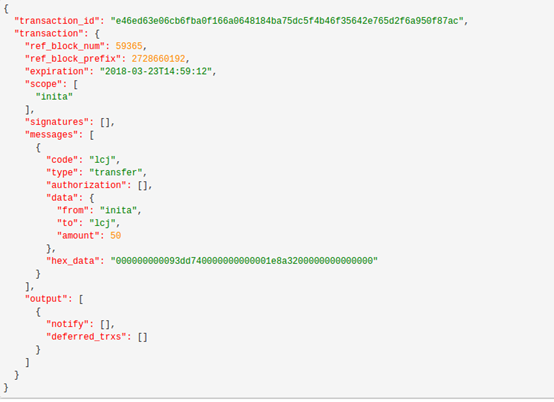

Scope：

用于指定读取或者写入数据的范围。如果一条消息尝试在范围之外读或写数据，那么这个交易就会失败。从此可以并行的处理交易，只要在范围内没有重叠。

### 1.3：Message/Action

| Field         | Type            | Description                                                  |
| ------------- | --------------- | ------------------------------------------------------------ |
| Code          | String          | 合约名称                                                     |
| Type          | String          | Name of action 行为                                          |
| Authorization | Nested_Document | 授权账户和权限                                               |
| Data          | Nested document | A nested document，any format,specific to message in   use(内嵌文档，任何形式的消息) |
| Hex_data      | String          | Hexadecimal representation   of data                         |

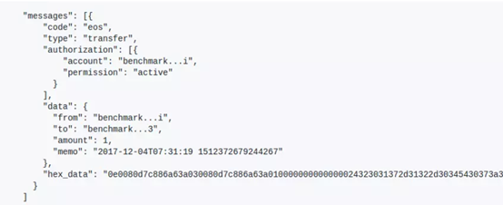

EOS智能合约是由一系列action组成，每个action代表一条合约条款。

客户端会将一组action封装成一个transaction数据包发送给服务器。这里借用了数据库事务的概念，一个transaction代表一个事务，在事务内的action要么全部执行，要么都不执行，必须保证事务的原子性。Transaction可以包含一个action，也可以包含多个action。


##  二：存储的过程

###  2.1 IPFS分布式文件系统（InterPlanetary File System）

星际文件系统（IPFS）是永久的、去中心化保存和共享文件的方法，这是一种内容可寻址、版本化、点对点超媒体的分布式协议。它有3个特点：

1. 内容可寻址：通过文件内容生成唯一哈希值来标识文件，而不是通过文件保存位置来标识。相同内容的文件在系统中只会存在一份，节约存储空间

2. 版本化：可追溯文件修改历史

3. 点对点超媒体：P2P 保存各种各样类型的数据

- 基于内容寻址，而非基于域名寻址。文件（内容）具有存在的唯一性，一个文件加入了IPFS的网络，将基于计算对内容赋予一个唯一加密的哈希值。这将改变我们使用域名访问网络的习惯。
- 提供文件的历史版本控制器（如git），并且让多节点使用保存不同版本的文件。
- IPFS的网络上运行着一条区块链，即用来存储互联网文件的哈希值表，每次有网络访问，即要在链上查询该内容（文件）的地址。
- 通过使用代币（FileCoin）的激励作用，让各节点有动力去存储数据。 Filecoin 是一个由加密货币驱动的存储网络。矿工通过为网络提供开放的硬盘空间获得Filecoin，而用户则用 Filecoin 来支付在去中心化网络中储存加密文件的费用。

 ​      比如我想观看一部叫ABC的视频

​         1, 加入IPFS网络，在网络中搜索叫ABC的文件，（通过IPNS——去中心化的文件命名系统）

​         2, IPFS网络迅速索引区块链上的哈希值，反馈出搜索结果。

​         3, 你支付一点FileCoin代币, 获取ABC文件缓存到本地，ABC文件不是从云或者服务器上下载下来的，而是由这个网络的参与者贡献的，它可能是离你最近的一个网络节点。这样的好处就是不仅不需要中间服务器，而且网络效率最快。

​         4, 如果ABC文件恰好你周边好几个人都有，那IPFS网络会把这个文件拆成一小片一小片，节省了这些节点的储存成本，也让你用最具效率的方式下载到该视频。

​         5, 这个视频文件缓存在自己电脑里，不仅自己观看，同时也为其他人提供资源。

​         6, 另外也可以自己发布新内容到这个网络上，并且有机会获得FileCoin代币，因为你也为网络做了贡献。

​         通过这样的方式，实现了整个网络的文件利用达到最优效率

### 2.2 EOS存储设计模型

EOS使用IPFS分布式文件系统作为底层存储。

生产者节点负责保存文件实际的数据，而客户端节点本地只保存文件的地址，所有客户端节点可以通过地址远程访问文件内容。这样可以为客户端节点节约大量的存储开销。

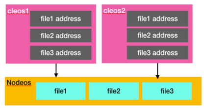

设计了一套文件系统智能合约，发行了一种 token 叫TOK。

它允许每个用户定义一个目录结构，这个目录结构下面的所有文件都链接了一个IPFS文件。也就是说TOK只存储IPFS的文件链接和一个可读的文件名。

为了获得IPFS存储空间的使用权限，用户需要持有一定数量的EOS存储代币（TOK）。每个EOS客户端需要定义一个本地home目录，用于存放IPFS文件链接。链接内容主要包括本地home目录路径、文件名（文件内容的hash值）、文件大小。

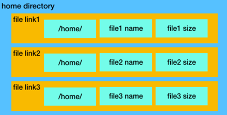

用户将文件链接打包成交易信息，签名后广播给区块生产者，然后用户通过EOS存储软件定义的标准化REST应用程序接口将文件上传到其中一个区块生产者。接着，这个生产者会校验文件内容hash值和文件大小是否正确，一旦校验成功，生产者会将交易信息广播给其它生产者并同步到TOK区块链上，表示文件已经保存成功。其它节点会通过IPFS网络同步保存文件信息。用户上传文件的流程如下：

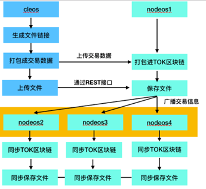

文件上传成功后，当客户端需要下载文件时，只需要将文件名发给生产者服务器，然后，服务器通过IPFS检索到对应的文件发送给客户端即可。一般来说，IPFS文件系统中的文件都是只读的，因为文件内容的细微修改就会导致客户端校验失败。

EOS存储的核心是IPFS，它提供了一个任何人都可以托管文件的去中心化网络，这些文件可以通过地址远程访问。区块生产者实际代表了21个超级节点，每个超级节点需要拥有支持高吞吐EOS交易量的数据中心，可以在全球范围提供文件托管服务，而且只要有至少一个超级节点在线，用户的文件就是可以访问的。


### 2.3 EOS数据库架构详解

在 EOS 中，智能合约执行完毕后，所占用的内存会释放。程序中的所有变量都会丢失。如果智能合约里要持久地记录信息，比如游戏智能合约要记录每位用户游戏记录，本次合约执行完毕后数据不能丢失，就需要将数据存储到 EOS 数据库中。与数据库交互的 API 被官方成为 Persistence API，中文可以叫做持久化 API。下图说明了 EOS 智能合约在执行 Action 时，与数据库的交互过程。

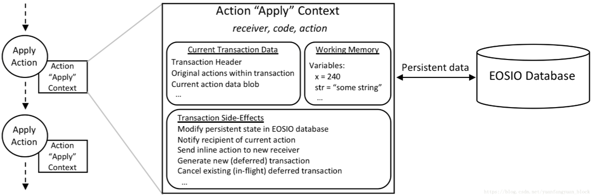

在 EOS 见证人硬盘中，为每个账户都预留了数据库空间（大小与代币持有量有关），每个账户名下可以建立多个数据表。智能合约无法直接操作存储在见证人硬盘中的数据表，需要使用`multi_index`作为中间工具（或者叫容器），每个`multi_index`实例都与一个特定账户的特定数据表进行交互（取决于实例化时的参数）。EOS智能合约与EOS数据库的数据交互如下图所示。

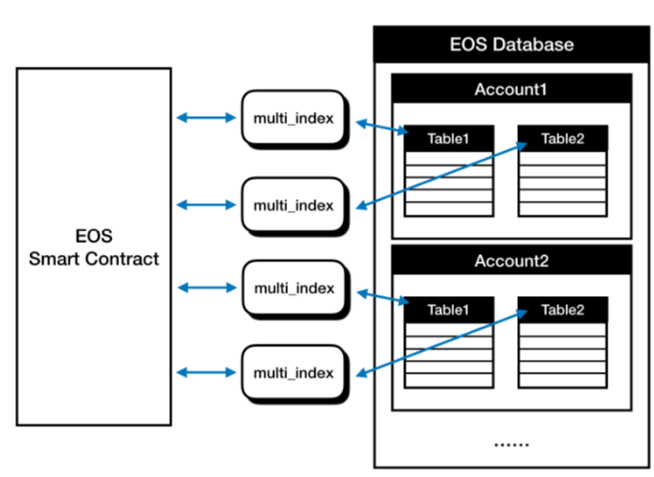

#### 数据表

multi_index`是一个非常方便的数据库交互容器，可以存储任何 C++ 数据类型。每一个`multi_index`都相当于传统数据库的一个数据表（table），但将传统数据库的行与列的形式改为了单纯的列。也就是说`multi_index`是一个线性排列的表，只有一列，每一行都只存储一个对象。但是一般来说`multi_index`存储的对象都是结构体或者类，里面含有多个成员变量，所以`multi_index存储数据的灵活性也是不亚于传统数据库的。

官方的“汽车维修店”示例，我们建立一个数据表，储存每个汽车维修店客户的账户名、保养时间、车辆里程。那么`multi_index`数据表储存的项目中，每个都是如下的结构体：

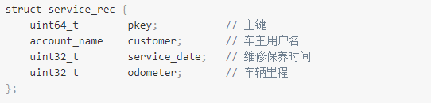

在传统数据库中，需要建立一个 4 列的数据表，用来储存每个用户的这个 4 个数据，而`multi_index`的每个数据表只有一列，只存储每个用户的 `service_rec` 整个结构体即可。下图为`multi_index`数据结构。

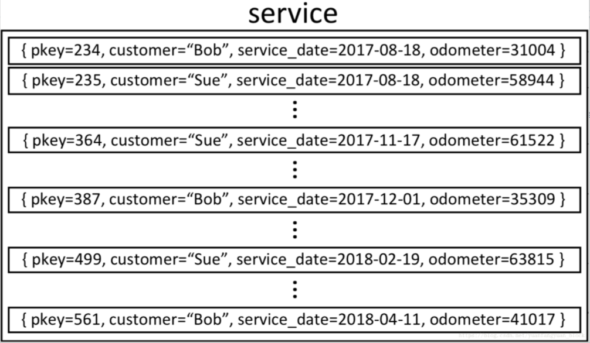

#### 多索引

首先，每个数据表要有一组主键，主键必须是无符号 64 位整数类型（64-bit integer），这就是上面的`service_rec`结构体中第一个变量为`uint64_t`类型的原因。在数据表中，所有的对象就是按照主键升序排列的，小的在前，大的在后。主键可以是有意义的，也可以是没有意义的，让系统产生一个在这个数据表中没有被使用的主键即可。为了设置主键，我们需要在之前的`service_rec`结构体添加一个叫做`primary_key（）`的成员函数函数的返回值为主键。

```js
	auto	primary_key()const { return pkey; }
```

这样就将`pkey`这个变量设置成了主键。

`multi_index`从字面上看就是能使用多个索引的数据表。EOS 中，每个`multi_index`或者说每个数据表都可以设置最多16个索引。索引相当于使用特定的方式给数据表中的对象重新排序。比如在我们经常使用的 windows 文件管理器中，可以按照文件名排序、按照文件修改时间排序、按照文件大小排序，这就有了3个索引。EOS 数据库索引更加灵活，可以单独按照结构体中的某个变量索引，也可以将变量之间的运算结果（函数输出）进行索引。如果我们想使用`车主用户名`进行索引，需要在结构体中添加一个`get_customer()`成员函数，函数的返回值为索引变量。 

```js
account_name    get_customer()const { return customer; }
```

这样就将`customer`这个变量设置成了数据表的一个索引，下图右侧为`customer`索引。

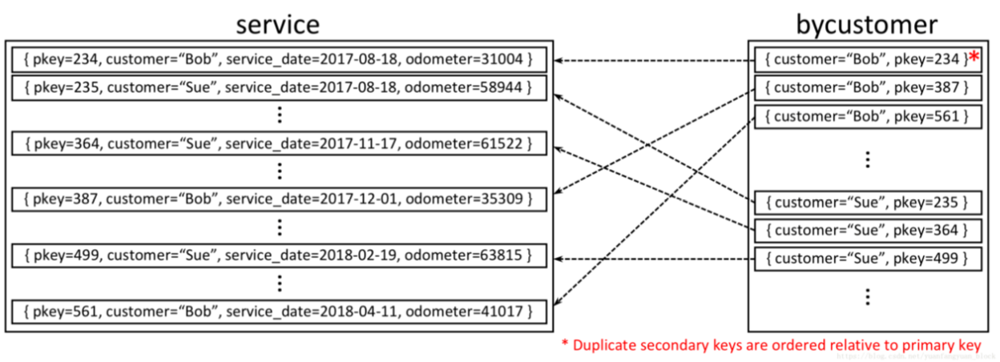

#### 迭代器

`multi_index`是如何操作数据表中的每个对象的呢？答案是 Iterators（迭代器）。在 EOS 数据库中，迭代器像一个“电梯”，在整个数据表中上下穿梭。所有对数据的操作必须通过迭代器完成。典型的数据修改过程是这样的：首先使用迭代器的`find()`方法，在特定的索引中寻找需要的数据，比如在车主用户名索引中寻找某个用户。迭代器会移动到需要的数据对象上。然后就可以使用迭代器的`modify()`方法修改当前迭代器对应的数据。下图为迭代器指向用户 Sue 的情况。

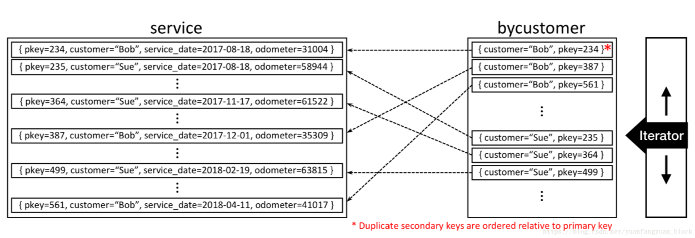