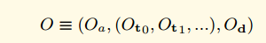

# Ethereum

## 一：区块结构

### 1.1 区块头

1. ParentHah:父块的哈希值
2. Nonce：一个随机数，使得块头哈希满足POW需求
3. Timestamp: 此区块成立时的unix的时间戳 
4. Ommershash：当前区块ommers列表的Hash值（ ommer就是一个区块的父区块与当前区块父区块的父区块是相同的）
5. Beneficiary：块打包手续费的受益人，也称矿工（接收挖此区块费用的账户地址 ）
6. Logsbloom：由日志信息组成的一个Bloom过滤器 （1.1.1节具体解释） 
7. Difficulty:POW的难度值
8. extra[Data](https://m.7234.cn/mip/z/Streamr/)：与此区块相关的附加数据
9. Number: 当前区块的计数（创世纪块的区块序号为0，对于每个后续区块，区块序号都增加1）
10. GasLimit:Gas限制
11. GasUsed:交易消耗的Gas（此区块中交易所用的总gas量）
12. Mixhash：一个Hash值，当与nonce组合时，证明此区块已经执行了足够的计算 
13. stateRoot：状态树根节点的Hash值
14. transactionsRoot：包含此区块所列的所有交易的树的根节点Hash值
15. receiptsRoot：包含此区块所列的所有交易收据的树的根节点Hash值

#### 1.1.1logsbloom

###### A: a transaction receipt contains the following elements:

1:The post-transaction state: a trie structure holding the state after the execution. Encoded as a byte array.

​               (blockHash: String, 32 Bytes - hash of the block where this transaction was in.
​                blockNumber: Number - block number where this transaction was in.
​                transactionHash: String, 32 Bytes - hash of the transaction.
​                transactionIndex: Number - integer of the transactions index position in the block.
​               from: String, 20 Bytes - address of the sender.
​               to: String, 20 Bytes - address of the receiver. null when its a contract creation transaction.)

2:Gas used: the total amount of gas used.

3:Logs: the set of logs entries created upon transaction execution.  //交易执行可能有很多logs

4:The bloom filter: it is created based on the information found int he logs. Logs entries are reduced are reduced to 256 bytes hashes, which are embedded in the block header as the logs bloom.

###### B: Log Entry

黄皮书里面对日志记录的形式化定义。

O代表我们的日志记录，Oa代表logger的地址，Oto,Ot1代表日志的Topics， Od代表时间。

Oa是20个字节，Ot是32个字节，Od是很多字节

定义了一个布隆过滤器函数M，用来把一个日志对象转换成256字节的hash

以太坊允许日志可以跟踪各种交易和信息。一个合约可以通过定义“事件”来显示的生成日志。

一个日志的实体包含：

（1）记录器的账户地址

（2）代表本次交易执行的各种事件的一系列主题以及与这些事件相关的任何数据

（3）日志被保存在bloom过滤器中，过滤器高效的保存了无尽的日志数据。

收据中的布隆过滤器就是所有的日志的布隆过滤器输出的并集。

同时区块头中的logBloom，就是所有的收据的布隆过滤器的并集。

以太坊中的Events和Logs基本上算是同一个概念。Solidity和web3.js中称为Events，以太坊黄皮书中称为Logs。你可以理解为：以太坊通过Logs实现Events（事件）功能。智能合约代码通过LOG 将日志写入区块链中。 

###  1.2 区块体

#### 1.2.1 transaction：

​        有两种类型的交易：**消息通信(message calls)**和**合约创建(contract creations)(也就是交易产生一个新的以太坊合约)**。

1：nonce：此交易的发送者已发送过的交易数

2：gasPrice：发送者愿意支付执行交易所需的每个gas的Wei数量 

3：gasLimit：发送者愿意为执行交易支付gas数量的最大值。这个数量被设置之后在任何计算完成之前就会被提前扣掉 

4：to：接收者的地址。在合约创建交易中，合约账户的地址还没有存在，所以值先空着 

5：value：从发送者转移到接收者的Wei数量。在合约创建交易中，value作为新建合约账户的开始余额 

6：v,r,s：用于产生标识交易发生着的签名

7：data（可选域，只有在消息通信中存在）：消息通话中的输入数据(也就是参数)。例如，如果智能合约就是一个域名注册服务，那么调用合约可能就会期待输入域例如域名和IP地址

## 二：存储的过程

​     区块和交易等数据最终都是存储在leveldb数据库中的，数据库的存储位置在datadir/geth/chaindata中。在core/database_util.go中封装了所有与区块存储和读取相关的代码，通过这些代码可以弄清楚区块、交易等数据结构在数据库中是如何存储的。

### 2.1区块存储

区块存储时将区块头和区块体分开存储。

#####    区块头的存储格式为：

​    headerPrefix + num (uint64 big endian) + hash -> rlpEncode(header)

   其中key由区块头前缀、区块号（uint64大端格式）、区块hash构成，value是区块头的RLP编码。

#####    区块体的存储格式为：

   bodyPrefix + num (uint64 big endian) + hash -> rlpEncode(block body)

   其中key由区块体前缀、区块号（uint64大端格式）、区块hash构成，value是区块体的RLP编码。

#####    key前缀

   key中的前缀可以用来区分数据的类型，在core/rawdb/scheme.go中定义了各种前缀：

   headerPrefix = []byte("h") // headerPrefix + num (uint64 big endian) + hash -> header

   tdSuffix = []byte("t") // headerPrefix + num (uint64 big endian) + hash + tdSuffix -> td

   numSuffix = []byte("n") // headerPrefix + num (uint64 big endian) + numSuffix -> hash

   blockHashPrefix = []byte("H") // blockHashPrefix + hash -> num (uint64 big endian)

   bodyPrefix = []byte("b") // bodyPrefix + num (uint64 big endian) + hash -> block body

   blockReceiptsPrefix = []byte("r") // blockReceiptsPrefix + num (uint64 big endian) + hash -> block receipts

   lookupPrefix = []byte("l") // lookupPrefix + hash -> transaction/receipt lookup metadata

   bloomBitsPrefix = []byte("B") // bloomBitsPrefix + bit (uint16 big endian) + section (uint64 big endian) + hash -> bloom bits

   其中headerPrefix定义了区块头key的前缀为h，bodyPrefix定义了区块体key的前缀为b。

####  区块头存储

​      存储区块头的函数:

​     它是先对区块头进行RLP编码，encodeBlockNumber将区块号转换成大端格式，然后组装key。这里先向数据库中存储一条区块hash->区块号 的记录，最后将区块头的RLP编码写到数据库中。

#### 区块体存储

​     将区块中的交易数据和叔块头信息进行 RLP 编码从而生成存储值value；

​     将数据类型前缀，编码后的区块高度和区块哈希拼接生成 key；

​     将存储至db数据库中。

###  2.2 交易存储

交易主要在数据库中仅存储交易的Meta信息。

txHash + txMetaSuffix -> rlpEncode(txMeta)

Meta信息结构体：

type TxLookupEntry struct {

​     BlockHash common.Hash  //块的hash

​     BlockIndex uint64  //块号

​     Index uint64   //块上第几笔交易

}

key："l"+交易hash

value：TxLookupEntry {区块hash，区块高度，交易位于区块的索引} ，Meta的RLP编码